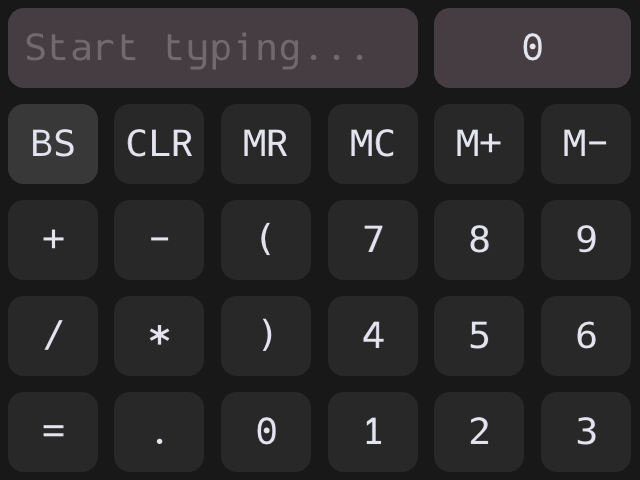

## calc


A bit overengineered calculator for [muOS](https://muos.dev) devices.

### Quickstart
Download `Calculator.muxzip` from releases, put it on device in `/mnt/mmc/ARCHIVE/`
and install it from the Archive Manager

### Gallery



### Build instructions

Compile time dependencies:
- A compatible C99 `aarch64-linux` cross-compiler.<br/>
  The default specified in the makefile is zig's magic cross-compiler, though any
  will do.<br/>
  Specify a custom compiler like this: `$ make CC="gcc"`
- GNU `ar` and `make`
- Linux binutils like `rm`, `mv`, `mkdir`
- 7-Zip's `7z` executable in PATH<br/>
  Needed to automatically package `Calculator.muxzip`

Runtime dependencies: None

> [!NOTE]
> To build this on windows use something like skeeto's amazing
[w64devkit](https://github.com/skeeto/w64devkit)

```console
$ make
````

### Used stuff
- [Proggy Dotted](https://github.com/bluescan/proggyfonts) as a main font
- [ARM Mali OpenGL headers and dynamic lib](https://github.com/Xilinx/mali-userspace-binaries)
  (SONAME was changed to properly link with ondevice `libmali.so`, original found in `proprietary/source/`)